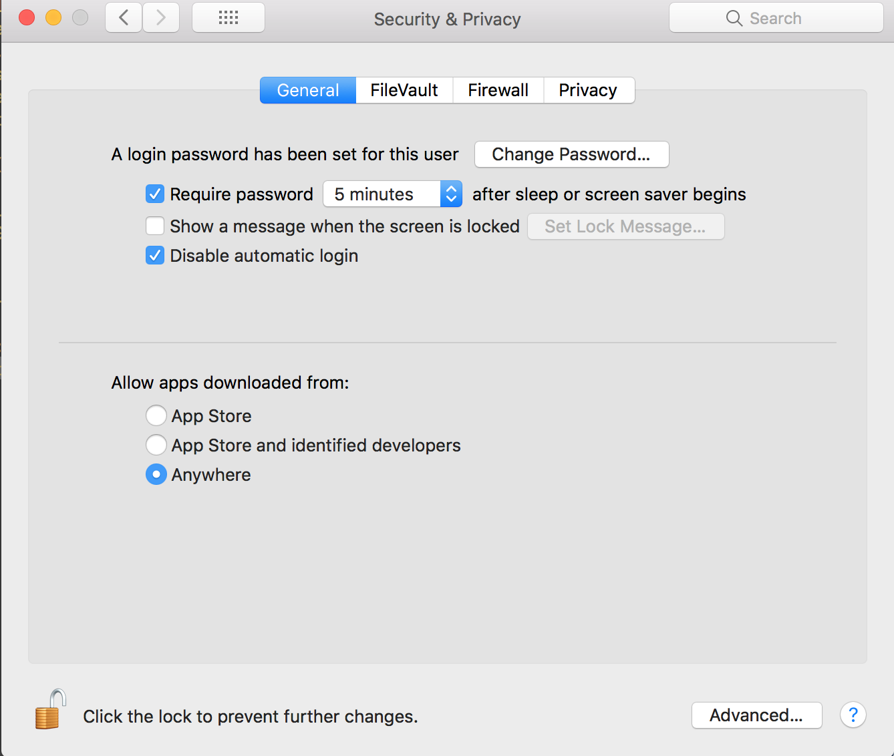
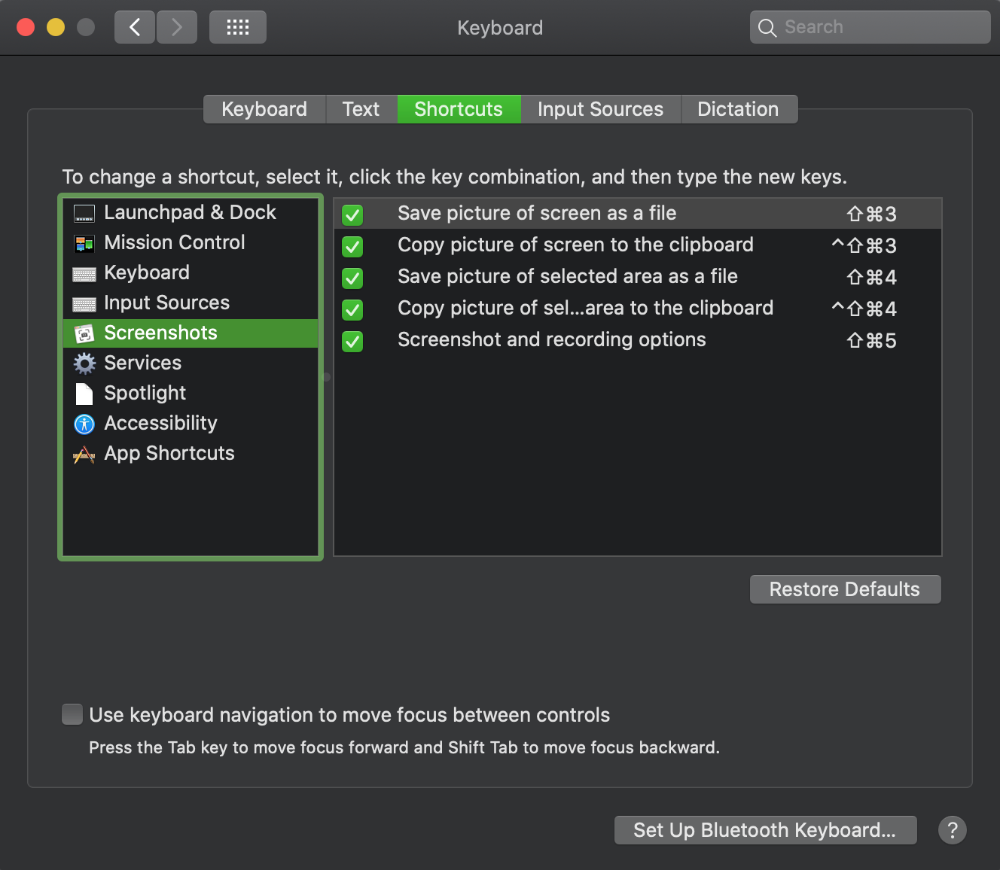

# Mac OS Settings

[TOC]

## 1、显示所有隐藏文件[^1]

### （1）临时显示隐藏文件

使用快捷键[^6]：`⌘ + ⇧ + .`


### （2）永久显示隐藏文件

Terminal输入下面命令，如下

```shell
$ defaults write com.apple.finder AppleShowAllFiles -boolean true; killall Finder
```


## 2、允许安装不明身份软件

```shell
$ sudo spctl --master-disable
```


在Security&Privacy面板




## 3、文件的@属性


### （1）查看@属性

```shell
$ ls -l@
```


### （2）移除@属性

```shell
$ xattr -c <file>
```


## 4、禁用System Integrity Protection


- 重启macOS，屏幕变黑时，按住⌘+R直到出现Logo
- Utilities -> Terminal，输入csrutil disable; reboot


## 5、修复系统屏幕截图不保存到桌面的问题[^3]





命令行执行下面命令

```shell
defaults write com.apple.screencapture location ~/Desktop
defaults write com.apple.screencapture target file
killall SystemUIServer
```


## 6、制作Finder中文件夹或文件的右键菜单[^4]


### （1）新建一个workflow

* Open **Applications** -> **Automator**
* **File** -> **New** in the menu bar
* Chose a document type of **Service**/**Quick Action**

Workflow receives current选择为**files or folders**，in选择为**Finder**，Image选择喜欢的图标icon。


### （2）编辑执行脚本

在左侧搜索框搜索**Run Shell Script**，拖拽到编辑区域。


以7z命令行作为右键菜单为例

Shell选择**/bin/bash**，Pass input选择**as arguments**。


然后，安装命令行工具p7zip

```shell
$ brew install p7zip
```


在刚才新建的Run Shell Script中，写入下面Shell脚本

```shell
# Note: use /usr/local/bin/7z instead of 7z for Automator
cmd=/usr/local/bin/7z

if ! [[ -x "$(command -v ${cmd})" ]]; then
  echo "Error: ${cmd} is not installed. Please brew install p7zip" >&2
  exit 1
fi

# Enter the first file's directory
current_path=$(dirname "$1")
cd "${current_path}"

#echo ${current_path}

args=""
for f in "$@"
do
  args="${args} \"$f\""
done

timestamp=$(date +"%Y-%m-%d_%H-%M-%S")
command="${cmd} a Archive@${timestamp}.7z ${args}"

#echo ${command} >&2
#exit 1
status=$(eval "${command}")

#echo ${status}

exit 0
```


### （3）调试脚本

​        在左侧搜索框搜索**Get Specific Finder Items**，拖拽到脚本区域上面。添加一个Finder中的文件或文件夹，作为**Run Shell Script**的输入参数，点击**Run**按钮进行调试。调试完成，点击右上角的x按钮，移除这个Action。


> 示例脚本，见Automator Settings/Compress with 7z.workflow


## 7、修复启动App提示“XXX” is damaged and can’t be opened. You should move it to the Trash.[^5]


执行下面的命令

```shell
$ sudo xattr -rd com.apple.quarantine /Applications/XXX.app
```


## 8、修复原装lightning USB线连接电脑总是断掉的问题


将lightning USB线连接电脑，执行下面命令。

```shell
$ sudo killall -STOP -c usbd
```

注意：

> usbd进程没有被杀掉，只是重新启动了


## 9、干净卸载PyCharm

除了删掉PyCharm.app，还有下面位置需要删除[^7]

```shell
$ cd ~/Library/Preferences/
$ ls | grep -i pycharm | xargs trash

$ cd ~/Library/Logs
$ ls | grep -i pycharm | xargs trash

$ cd ~/Library/Application\ Support/
$ ls | grep -i pycharm | xargs trash

$ cd ~/Library/Caches/
$ ls | grep -i pycharm | xargs trash
```


## 10、登录界面去掉Other用户登录

执行下面命令进行禁用[^8]

```shell
sudo defaults write /Library/Preferences/com.apple.loginwindow SHOWOTHERUSERS_MANAGED -bool FALSE
```


## 11、压缩文件不带`__MACOSX`文件夹和`.DS_Store`文件[^9]

在MacOS下，使用Finder压缩一个文件，会默认带`__MACOSX`文件夹，可能还会带`.DS_Store`。

使用下面命令，避免带这些隐藏文件

```shell
$ zip -r yourFile.zip path/to/file -x ".*" -x "__MACOSX" 
```


示例操作，如下

```shell
$ zip -r yourFile.zip path/to/file -x ".*" -x "__MACOSX" 
  adding: surgeon.txt (deflated 71%)
$ unzip -l yourFile.zip 
Archive:  patch.zip
  Length      Date    Time    Name
---------  ---------- -----   ----
     1385  04-01-2022 11:17   1.txt
---------                     -------
     1385                     1 file
```


## 11、删除系统自带app

- 重启macOS，屏幕变黑时，按住⌘+R直到出现Logo[^9]
- Terminal，输入下面命令[^8]

以macOS 10.15 Catalina为例

```shell
# csrutil status
# csrutil disable
# sudo mount -uw /
# cd /Volumes/Macintosh\ HD/System/Applications/
# rm -rf xxx.app
# csrutil enable
# reboot
```


说明

> 1. 如果rm命令无效，再尝试`sudo mount -uw /`
> 2. 不同的macOS系统，系统app所在目录路径不同，如下
>    * macOS 10.15 Catalina：`/Volumes/Macintosh\ HD/System/Applications/`
>    * macOS 10.12 Sierra、OS X 10.11 El Capitan：`/Volumes/Macintosh\ HD/Applications/`


## References

[^1]:https://apple.stackexchange.com/questions/340542/show-hidden-files-on-mac-os-x-mojave-using-terminal

[^2]:https://stackoverflow.com/questions/4833052/how-do-i-remove-the-extended-attributes-on-a-file-in-mac-os-x

[^3]:https://apple.stackexchange.com/a/348043

[^4]:https://davidwalsh.name/mac-context-menu

[^5]:https://apple.stackexchange.com/questions/262355/xxx-cant-be-opened-you-should-move-it-to-trash-for-flash-projector-applicat

[^6]:https://apple.stackexchange.com/questions/340542/show-hidden-files-on-mac-os-x-mojave-using-terminal

[^7]:https://zhuanlan.zhihu.com/p/110013605

[^8]:https://apple.stackexchange.com/questions/232449/remove-other-from-login-screen
[^9]:https://my.oschina.net/u/4387124/blog/3250829
[^10]:https://superuser.com/questions/1490326/how-to-delete-system-apps-in-macos-catalina

[^9]:https://perishablepress.com/remove-macosx-ds-store-zip-files-mac/

